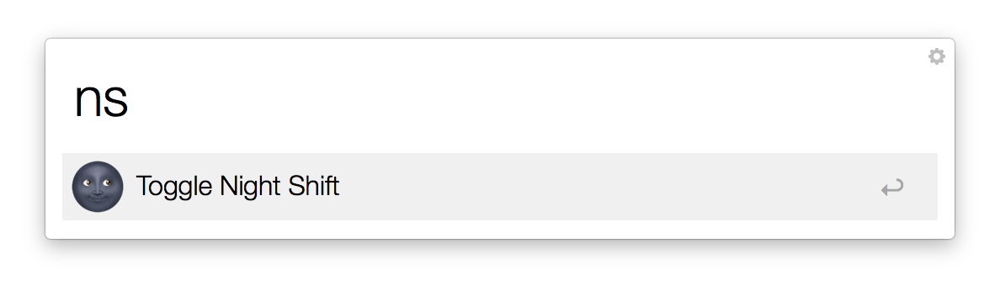
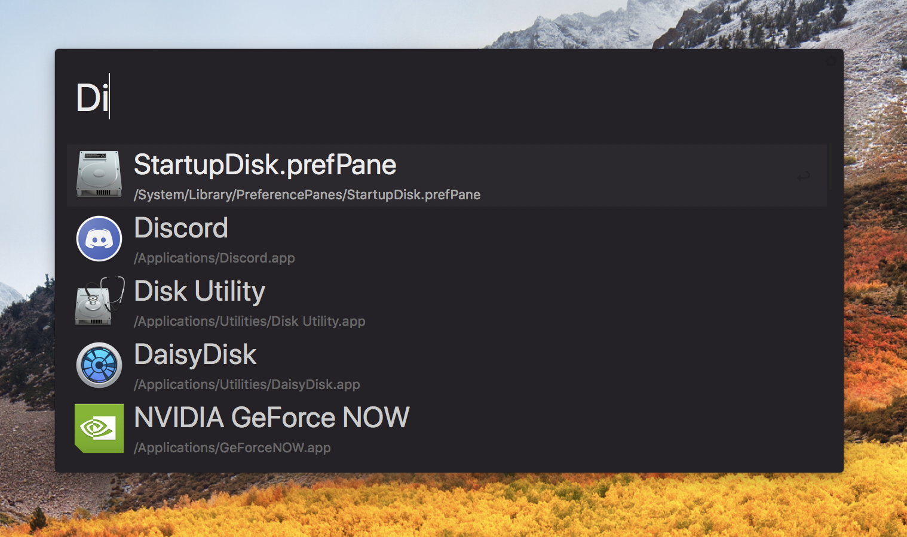
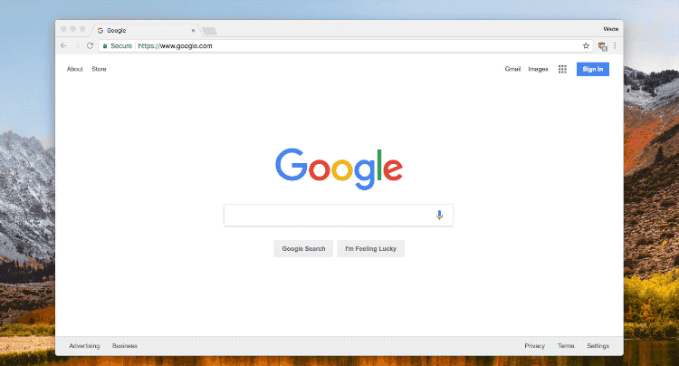

Open App or HotKey Window (if not running) on HotKey Press
=====================
I primarily use iTerm2's hotkey window while using terminal. Nothing's more annoying than trying to activate the window, it failing to activate, and realizing the application's not running. This solves that problem.

[Download](https://github.com/wad3g/alfred-workflows/alfred-toggle-night-shift/raw/master/alfred-toggle-night-shift.alfredworkflow)

Toggle Night Shift on macOS
=====================

An [Alfred](http://www.alfredapp.com/#download) workflow to toggle *Night Shift*.

## Usage
- Type type `ns` to toggle Night Shift

*Note*: 
You must allow Alfred to control your computer in order to use this workflow.

1. Go to System Preferences -> Security & Privacy -> Privacy -> Accessibility
2. Make sure Alfred is checked

[Download](https://github.com/wad3g/alfred-workflows/alfred-toggle-night-shift/raw/master/alfred-toggle-night-shift.alfredworkflow)

An Alfred Theme That Doesn't Suck
=====================

A simple, dark [Alfred](http://www.alfredapp.com/#download) Theme that doesn't suck

[Download](https://github.com/wad3g/alfred-workflows/alfred-toggle-night-shift/raw/master/alfred-toggle-night-shift.alfredworkflow)

Open New Chrome (or Canary) Incognito Window
=====================

An [Alfred](http://www.alfredapp.com/#download) workflow to open a new [Google Chrome Canary](https://www.google.com/chrome/browser/canary.html), or [Chrome](https://www.google.com/chrome/), Incognito window.

Click [Download](https://github.com/wad3g/alfred-workflows/alfred-chrome-canary-incognito/blob/master/Chrome:Canary%20Incognito.alfredworkflow?raw=true) to download the workflow.

## Usage
- Type `ccincog` OR `double-tap ⌘` (command) for Google Chrome Canary Incognito Window

*Note*: If you'd rather use Google Chrome, and not Canary, the keyword is as followed: `cincog` OR `double-tap ⌥` (option).

[Download](https://github.com/wad3g/alfred-workflows/alfred-toggle-night-shift/raw/master/alfred-toggle-night-shift.alfredworkflow)

Open New Resized New Chrome (or Canary) Window 
=====================

An [Alfred](http://www.alfredapp.com/#download) workflow to open [Chrome Canary's](https://www.google.com/chrome/browser/canary.html) (or [Chrome](https://www.google.com/chrome/)) current tab in a new resized window, multiple resized windows, or a new resized window that also opens DevTools.

## Usage
- Type `ccsm` to open Chrome Canary's active tab in a new window, resized to 320px for mobile testing.

- Type `ccmd` to open Chrome Canary's active tab in a new window, resized to 600px for tablet testing.

- Type `cclg` to open Chrome Canary's active tab in a new window, resized to 1200px for desktop testing.

- Type `ccdev` to open Chrome Canary's active tab in two new windows. The first resized to 320px and the second to 1200px for testing mobile and desktop.

*Note*: If you'd rather use Google Chrome, and not Canary, the keywords are as followed: `csm`, `cmd`, `clg`, `cdev`.

## Lauching DevTools
If you'd like to launch DevTools along side your new window you may do so by adding `⌘` (command) to the end of any of the previously mentioned keywords (with the exception of `ccdev`).

Example: `cclg⌘` will open a new window and launch DevTools open

[Download](https://github.com/wad3g/alfred-workflows/alfred-toggle-night-shift/raw/master/alfred-toggle-night-shift.alfredworkflow)
